# cmd/api — Architecture

> Detailed diagrams for the Glens REST API server.
> Master diagrams: [docs/diagrams/architecture.md](../../../docs/diagrams/architecture.md)

## Request Flow

```mermaid
%%{init: {'theme': 'base', 'themeVariables': {'primaryColor': '#7c3aed', 'primaryTextColor': '#fff', 'lineColor': '#475569', 'fontSize': '14px'}}}%%
flowchart TD
    REQ["🖥️ HTTP Request"] --> MW1["Recovery middleware\ncatch panics"]
    MW1 --> MW2["Logging middleware\nrequest/response log"]
    MW2 --> MW3["CORS middleware\ncross-origin headers"]
    MW3 --> ROUTER["Router — http.ServeMux"]

    ROUTER --> H1["GET /healthz\nversion + status"]
    ROUTER --> H2["POST /api/v1/analyze\nfull analysis run"]
    ROUTER --> H3["POST /api/v1/analyze/preview\ndry-run preview"]
    ROUTER --> H4["GET /api/v1/models\nlist AI models"]
    ROUTER --> H5["POST /api/v1/mcp\nMCP protocol"]

    H1 --> RESP["JSON Response"]
    H2 --> RESP
    H3 --> RESP
    H4 --> RESP
    H5 --> RESP

    style REQ fill:#0f172a,stroke:#1e293b,color:#fff
    style MW1 fill:#b91c1c,stroke:#991b1b,color:#fff
    style MW2 fill:#7c3aed,stroke:#6d28d9,color:#fff
    style MW3 fill:#7c3aed,stroke:#6d28d9,color:#fff
    style ROUTER fill:#1e40af,stroke:#1e3a8a,color:#fff
    style H1 fill:#15803d,stroke:#166534,color:#fff
    style H2 fill:#b45309,stroke:#92400e,color:#fff
    style H3 fill:#b45309,stroke:#92400e,color:#fff
    style H4 fill:#0369a1,stroke:#075985,color:#fff
    style H5 fill:#6d28d9,stroke:#5b21b6,color:#fff
    style RESP fill:#15803d,stroke:#166534,color:#fff
```

## Analyze Endpoint — Sequence Diagram

```mermaid
%%{init: {'theme': 'base', 'themeVariables': {'actorTextColor': '#0f172a', 'actorBkg': '#e2e8f0', 'actorBorder': '#475569', 'signalColor': '#1e40af', 'signalTextColor': '#0f172a', 'noteBkgColor': '#fef3c7', 'noteTextColor': '#0f172a', 'noteBorderColor': '#d97706', 'fontSize': '14px'}}}%%
sequenceDiagram
    actor Client
    participant MW as Middleware
    participant H as handler.Analyze
    participant Core as glens core

    Client ->> MW: POST /api/v1/analyze
    MW ->> MW: Recovery → Logging → CORS
    MW ->> H: route matched

    H ->> H: decode JSON body
    H ->> Core: run analysis pipeline
    Core -->> H: results
    H ->> H: encode JSON response
    H -->> Client: 200 OK + results

    alt Error
        H -->> Client: 4xx/5xx Problem Details
    end
```

## Internal Package Layout

```mermaid
%%{init: {'theme': 'base', 'themeVariables': {'primaryColor': '#7c3aed', 'primaryTextColor': '#fff', 'lineColor': '#475569', 'fontSize': '14px'}}}%%
graph TB
    MAIN["main.go\nHTTP server setup"]

    subgraph INT ["internal/"]
        subgraph HAND ["handler/"]
            HEALTH["health.go"]
            ANALYZE["analyze.go"]
            PREVIEW["preview.go"]
            MODELS["models.go"]
            MCP["mcp.go"]
            PROBLEM["problem.go\nRFC 9457 errors"]
        end

        subgraph MID ["middleware/"]
            MWARE["middleware.go\nRecovery · Logging · CORS"]
        end
    end

    PKG["pkg/logging\nzerolog wrapper"]

    MAIN --> HAND
    MAIN --> MID
    MAIN --> PKG

    style INT fill:#f1f5f9,stroke:#94a3b8,color:#0f172a
    style HAND fill:#eff6ff,stroke:#93c5fd,color:#0f172a
    style MID fill:#eff6ff,stroke:#93c5fd,color:#0f172a
    style MAIN fill:#7c3aed,stroke:#6d28d9,color:#fff
    style HEALTH fill:#15803d,stroke:#166534,color:#fff
    style ANALYZE fill:#b45309,stroke:#92400e,color:#fff
    style PREVIEW fill:#b45309,stroke:#92400e,color:#fff
    style MODELS fill:#0369a1,stroke:#075985,color:#fff
    style MCP fill:#6d28d9,stroke:#5b21b6,color:#fff
    style PROBLEM fill:#b91c1c,stroke:#991b1b,color:#fff
    style MWARE fill:#7c3aed,stroke:#6d28d9,color:#fff
    style PKG fill:#15803d,stroke:#166534,color:#fff
```

