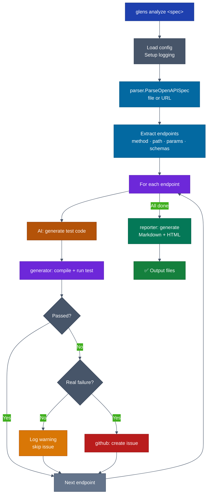
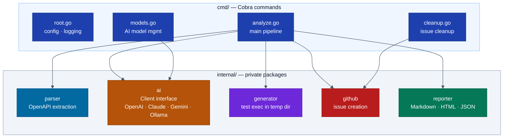
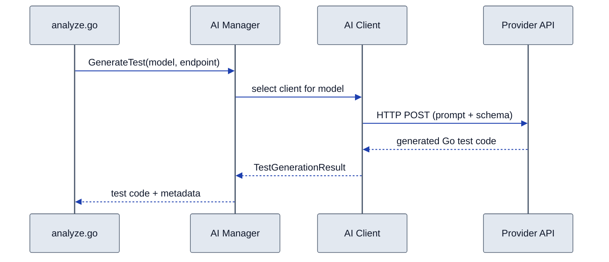
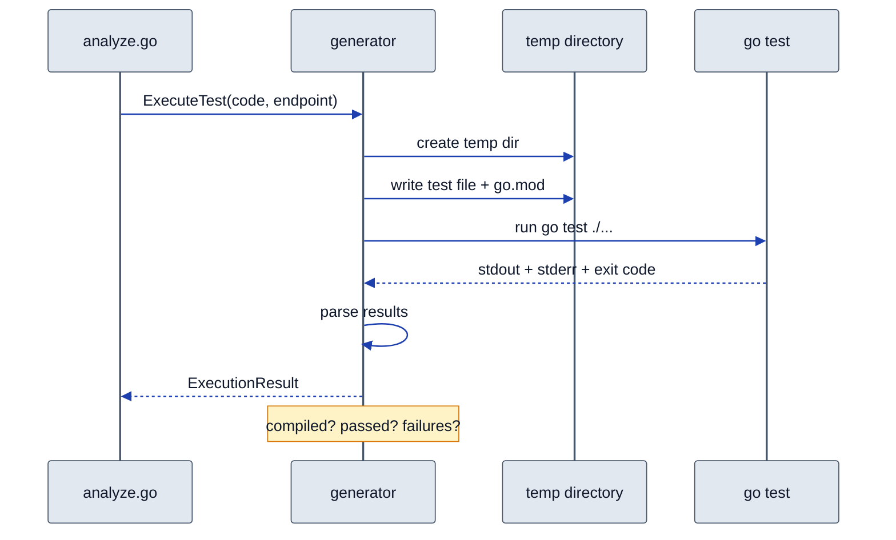

# cmd/glens — Architecture

> Detailed diagrams for the main Glens CLI module.
> Master diagrams: [docs/diagrams/architecture.md](../../../docs/diagrams/architecture.md)

## Analyze Command — Pipeline Flow

## Internal Package Layout

## AI Provider — Sequence Diagram

## Test Execution — Sequence Diagram

