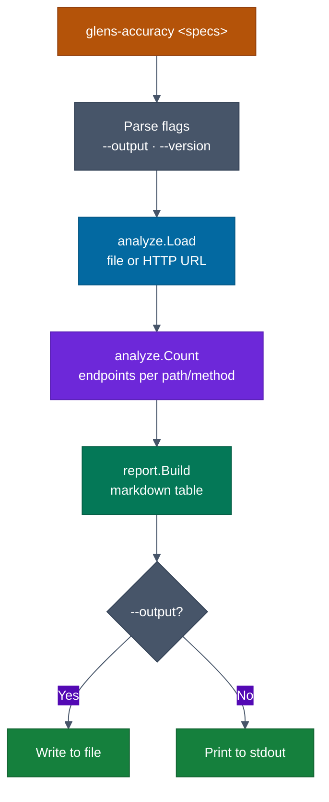
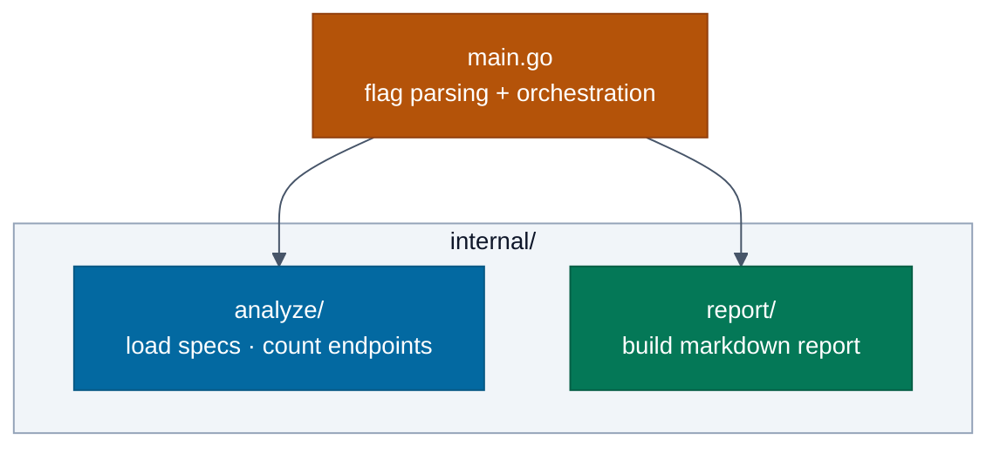

# cmd/tools/accuracy — Architecture

> Detailed diagrams for the endpoint accuracy reporter tool.
> Master diagrams: [docs/diagrams/architecture.md](../../../../docs/diagrams/architecture.md)

## Accuracy Tool — Flow

## Internal Package Layout

