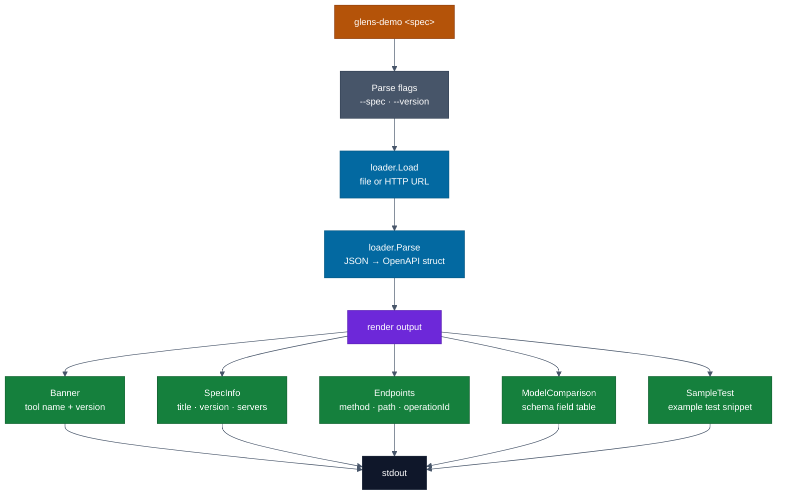
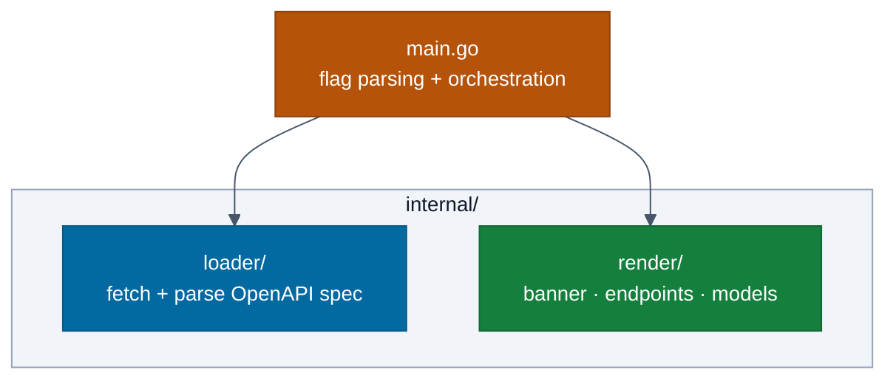

# cmd/tools/demo — Architecture

> Detailed diagrams for the OpenAPI spec visualiser tool.
> Master diagrams: [docs/diagrams/architecture.md](../../../../docs/diagrams/architecture.md)

## Demo Tool — Flow

## Internal Package Layout

