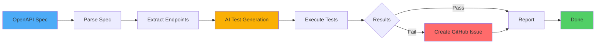
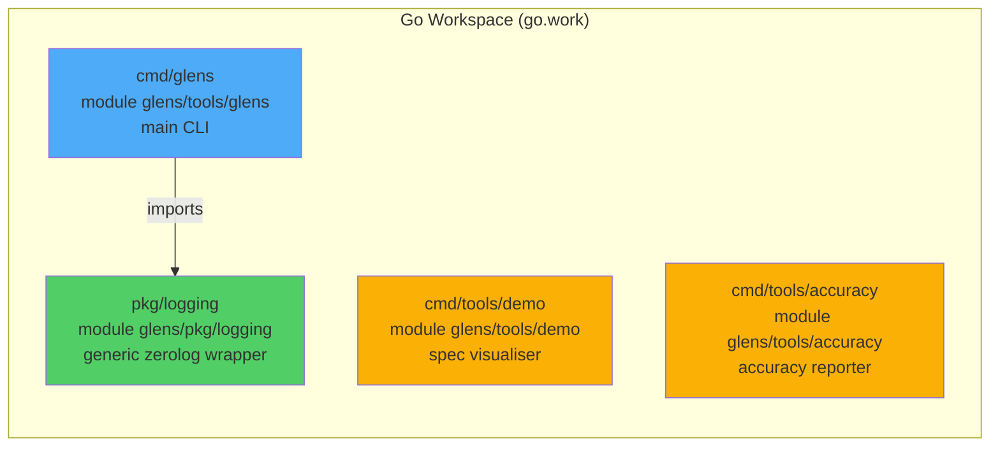
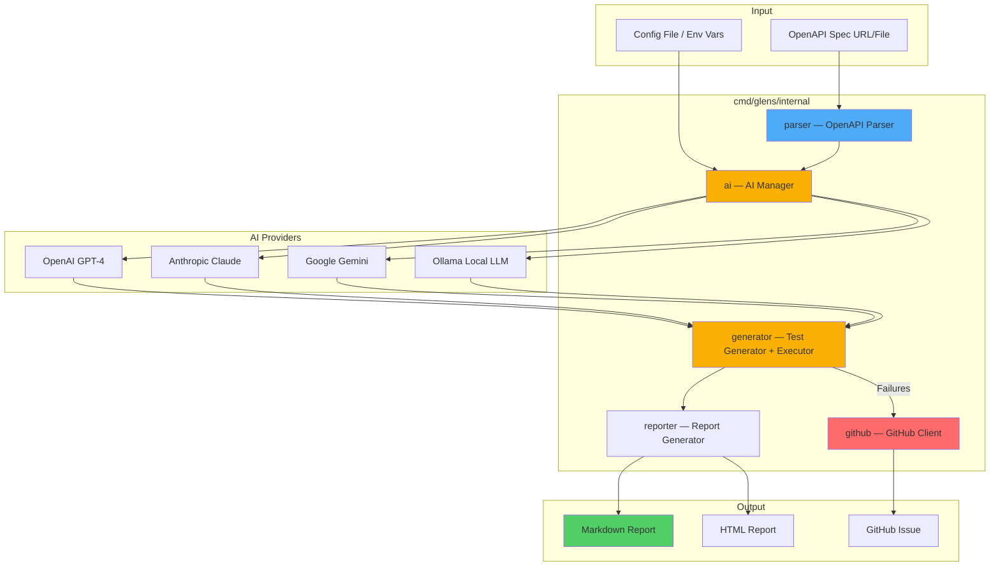
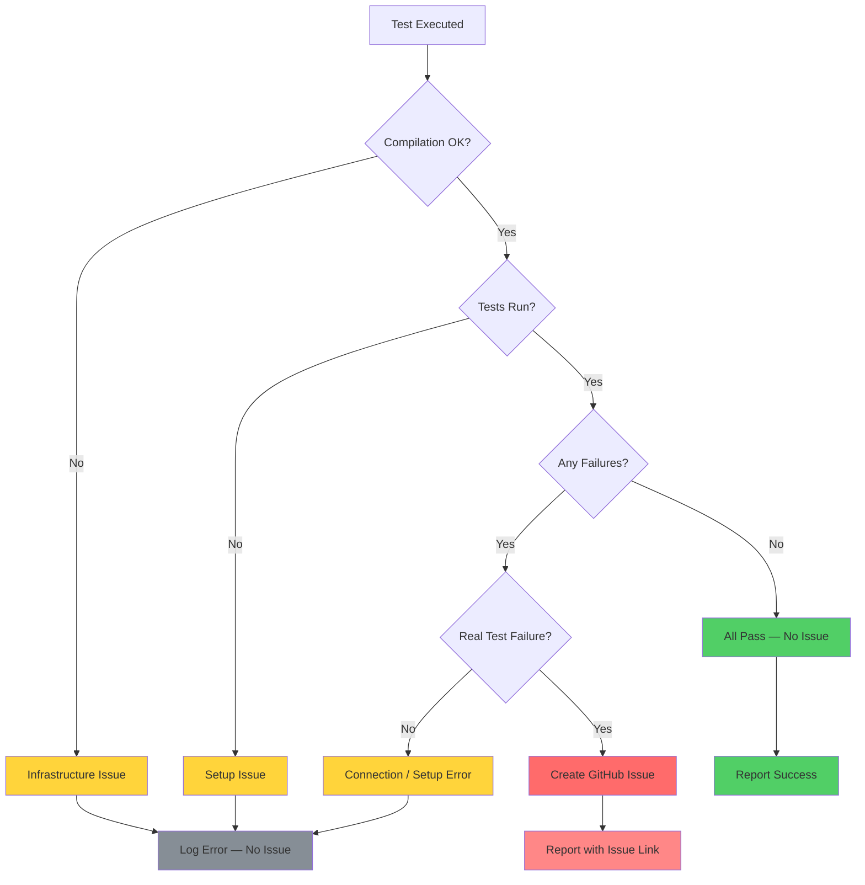
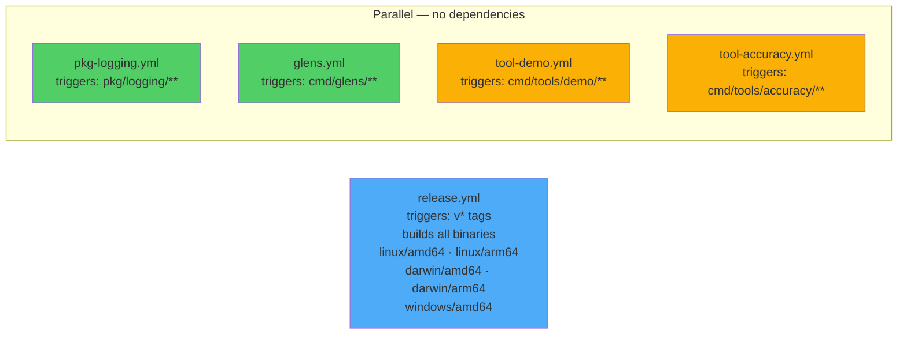

# Glens Architecture

## High-Level Flow

```mermaid
flowchart LR
    A[OpenAPI Spec] --> B[Parse Spec]
    B --> C[Extract Endpoints]
    C --> D[AI Test Generation]
    D --> E[Execute Tests]
    E --> F{Results}
    F -->|Pass| G[Report]
    F -->|Fail| H[Create GitHub Issue]
    H --> G
    G --> I[Done]

    style A fill:#4dabf7
    style D fill:#fab005
    style H fill:#ff6b6b
    style I fill:#51cf66
```

## Workspace Module Layout

```mermaid
graph TB
    subgraph "Go Workspace (go.work)"
        direction TB
        PKG["pkg/logging<br/>module glens/pkg/logging<br/>generic zerolog wrapper"]
        GLENS["cmd/glens<br/>module glens/tools/glens<br/>main CLI"]
        DEMO["cmd/tools/demo<br/>module glens/tools/demo<br/>spec visualiser"]
        ACC["cmd/tools/accuracy<br/>module glens/tools/accuracy<br/>accuracy reporter"]
    end

    GLENS -->|imports| PKG

    style PKG fill:#51cf66
    style GLENS fill:#4dabf7
    style DEMO fill:#fab005
    style ACC fill:#fab005
```

## glens CLI Component Architecture

```mermaid
graph TB
    subgraph "Input"
        URL[OpenAPI Spec URL/File]
        CFG[Config File / Env Vars]
    end

    subgraph "cmd/glens/internal"
        PARSE[parser — OpenAPI Parser]
        MGR[ai — AI Manager]
        GEN[generator — Test Generator + Executor]
        GH[github — GitHub Client]
        REP[reporter — Report Generator]
    end

    subgraph "AI Providers"
        GPT[OpenAI GPT-4]
        CLAUDE[Anthropic Claude]
        GEMINI[Google Gemini]
        OLLAMA[Ollama Local LLM]
    end

    subgraph "Output"
        MD[Markdown Report]
        HTML[HTML Report]
        ISSUE[GitHub Issue]
    end

    URL --> PARSE
    CFG --> MGR
    PARSE --> MGR
    MGR --> GPT & CLAUDE & GEMINI & OLLAMA
    GPT & CLAUDE & GEMINI & OLLAMA --> GEN
    GEN --> |Failures| GH --> ISSUE
    GEN --> REP --> MD & HTML

    style PARSE fill:#4dabf7
    style MGR fill:#fab005
    style GEN fill:#fab005
    style GH fill:#ff6b6b
    style MD fill:#51cf66
```

## Issue Creation Decision Logic

```mermaid
flowchart TD
    A[Test Executed] --> B{Compilation OK?}
    B -->|No| C[Infrastructure Issue]
    B -->|Yes| D{Tests Run?}
    D -->|No| E[Setup Issue]
    D -->|Yes| F{Any Failures?}
    F -->|No| G[All Pass — No Issue]
    F -->|Yes| H{Real Test Failure?}
    H -->|No| I[Connection / Setup Error]
    H -->|Yes| J[Create GitHub Issue]

    C --> K[Log Error — No Issue]
    E --> K
    I --> K
    G --> L[Report Success]
    J --> M[Report with Issue Link]

    style C fill:#ffd43b
    style E fill:#ffd43b
    style I fill:#ffd43b
    style K fill:#868e96
    style G fill:#51cf66
    style J fill:#ff6b6b
    style L fill:#51cf66
    style M fill:#ff8787
```

## CI Workflow Structure

```mermaid
graph LR
    subgraph "Parallel — no dependencies"
        PL["pkg-logging.yml<br/>triggers: pkg/logging/**"]
        GL["glens.yml<br/>triggers: cmd/glens/**"]
        TD["tool-demo.yml<br/>triggers: cmd/tools/demo/**"]
        TA["tool-accuracy.yml<br/>triggers: cmd/tools/accuracy/**"]
    end

    REL["release.yml<br/>triggers: v* tags<br/>builds all binaries<br/>linux/amd64 · linux/arm64<br/>darwin/amd64 · darwin/arm64<br/>windows/amd64"]

    style REL fill:#4dabf7
    style PL fill:#51cf66
    style GL fill:#51cf66
    style TD fill:#fab005
    style TA fill:#fab005
```
