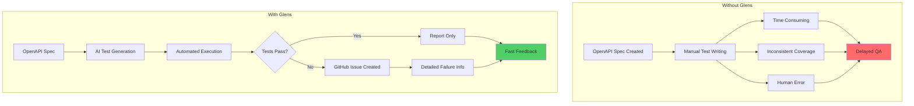
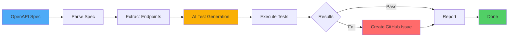
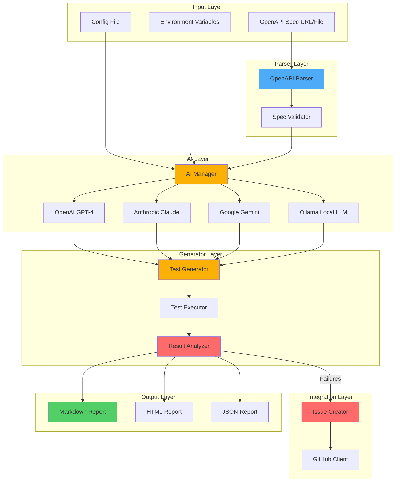
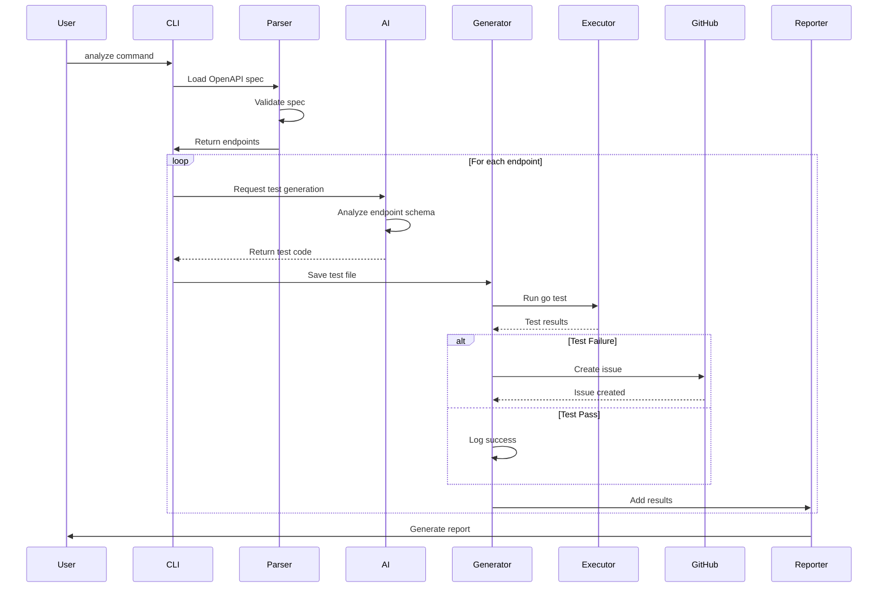
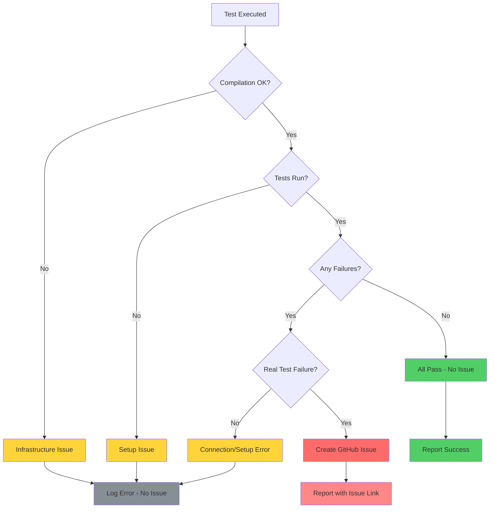
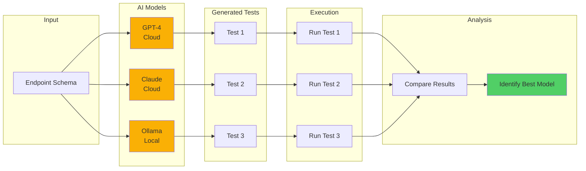
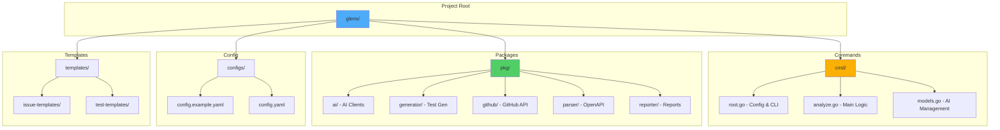

# Glens Architecture

## Problem It Solves

## High-Level Flow

## Detailed Component Architecture

## Test Generation Flow

## Issue Creation Decision Logic

## AI Model Comparison Flow

## File Structure

