# Glens — System Architecture

> Master diagrams for the entire Glens monorepo.
> Per-module diagrams live in each module's `docs/diagrams/` directory.

## System Overview

```mermaid
%%{init: {'theme': 'base', 'themeVariables': {'primaryColor': '#2563eb', 'primaryTextColor': '#fff', 'lineColor': '#475569', 'fontSize': '14px'}}}%%
flowchart LR
    SPEC["📄 OpenAPI Spec"] --> PARSE["⚙️ Parse Spec"]
    PARSE --> AI["🤖 Generate Tests"]
    AI --> EXEC["▶ Execute Tests"]
    EXEC --> DECIDE{Pass?}
    DECIDE -->|Yes| REPORT["📊 Report"]
    DECIDE -->|No| ISSUE["🐛 GitHub Issue"]
    ISSUE --> REPORT
    REPORT --> DONE["✅ Done"]

    style SPEC fill:#1e40af,stroke:#1e3a8a,color:#fff
    style PARSE fill:#0369a1,stroke:#075985,color:#fff
    style AI fill:#b45309,stroke:#92400e,color:#fff
    style EXEC fill:#6d28d9,stroke:#5b21b6,color:#fff
    style DECIDE fill:#475569,stroke:#334155,color:#fff
    style REPORT fill:#047857,stroke:#065f46,color:#fff
    style ISSUE fill:#b91c1c,stroke:#991b1b,color:#fff
    style DONE fill:#15803d,stroke:#166534,color:#fff
```

## Workspace Module Layout

```mermaid
%%{init: {'theme': 'base', 'themeVariables': {'primaryColor': '#1e40af', 'primaryTextColor': '#fff', 'lineColor': '#475569', 'fontSize': '14px'}}}%%
graph TB
    subgraph WS ["Go Workspace — go.work"]
        direction TB
        PKG["📦 pkg/logging\nzerolog wrapper"]
        GLENS["⚙️ cmd/glens\nmain CLI"]
        API["🌐 cmd/api\nREST API server"]
        DEMO["🎨 cmd/tools/demo\nspec visualiser"]
        ACC["📈 cmd/tools/accuracy\naccuracy reporter"]
    end

    GLENS -->|imports| PKG
    API -->|imports| PKG

    style WS fill:#f1f5f9,stroke:#94a3b8,color:#0f172a
    style PKG fill:#15803d,stroke:#166534,color:#fff
    style GLENS fill:#1e40af,stroke:#1e3a8a,color:#fff
    style API fill:#7c3aed,stroke:#6d28d9,color:#fff
    style DEMO fill:#b45309,stroke:#92400e,color:#fff
    style ACC fill:#b45309,stroke:#92400e,color:#fff
```

## Analyze Pipeline — Sequence Diagram

## glens CLI — Component Architecture

```mermaid
%%{init: {'theme': 'base', 'themeVariables': {'primaryColor': '#1e40af', 'primaryTextColor': '#fff', 'lineColor': '#475569', 'fontSize': '14px'}}}%%
graph TB
    subgraph INPUT ["Input"]
        URL["📄 OpenAPI Spec\nURL or file"]
        CFG["⚙️ Config\nYAML / env vars"]
    end

    subgraph INTERNAL ["cmd/glens/internal"]
        PARSE["parser\nOpenAPI extraction"]
        MGR["ai\nAI Manager"]
        GEN["generator\ntest gen + exec"]
        GH["github\nGitHub client"]
        REP["reporter\nreport output"]
    end

    subgraph PROVIDERS ["AI Providers"]
        GPT["OpenAI GPT-4"]
        CLAUDE["Anthropic Claude"]
        GEMINI["Google Gemini"]
        OLLAMA["Ollama local"]
    end

    subgraph OUTPUT ["Output"]
        MD["📝 Markdown"]
        HTML["🌐 HTML"]
        ISSUE["🐛 GitHub Issue"]
    end

    URL --> PARSE
    CFG --> MGR
    PARSE --> MGR
    MGR --> GPT & CLAUDE & GEMINI & OLLAMA
    GPT & CLAUDE & GEMINI & OLLAMA --> GEN
    GEN -->|failures| GH --> ISSUE
    GEN --> REP --> MD & HTML

    style INPUT fill:#f1f5f9,stroke:#94a3b8,color:#0f172a
    style INTERNAL fill:#eff6ff,stroke:#93c5fd,color:#0f172a
    style PROVIDERS fill:#fefce8,stroke:#fde047,color:#0f172a
    style OUTPUT fill:#f0fdf4,stroke:#86efac,color:#0f172a
    style PARSE fill:#0369a1,stroke:#075985,color:#fff
    style MGR fill:#b45309,stroke:#92400e,color:#fff
    style GEN fill:#6d28d9,stroke:#5b21b6,color:#fff
    style GH fill:#b91c1c,stroke:#991b1b,color:#fff
    style REP fill:#047857,stroke:#065f46,color:#fff
    style URL fill:#1e40af,stroke:#1e3a8a,color:#fff
    style CFG fill:#475569,stroke:#334155,color:#fff
    style GPT fill:#0f172a,stroke:#1e293b,color:#fff
    style CLAUDE fill:#0f172a,stroke:#1e293b,color:#fff
    style GEMINI fill:#0f172a,stroke:#1e293b,color:#fff
    style OLLAMA fill:#0f172a,stroke:#1e293b,color:#fff
    style MD fill:#15803d,stroke:#166534,color:#fff
    style HTML fill:#15803d,stroke:#166534,color:#fff
    style ISSUE fill:#b91c1c,stroke:#991b1b,color:#fff
```

## Issue Creation — Decision Logic

```mermaid
%%{init: {'theme': 'base', 'themeVariables': {'primaryColor': '#1e40af', 'primaryTextColor': '#fff', 'lineColor': '#475569', 'fontSize': '14px'}}}%%
flowchart TD
    A["▶ Test executed"] --> B{Compiled?}
    B -->|No| C["⚠️ Infrastructure issue"]
    B -->|Yes| D{Tests ran?}
    D -->|No| E["⚠️ Setup issue"]
    D -->|Yes| F{Failures?}
    F -->|No| G["✅ All pass"]
    F -->|Yes| H{Real failure?}
    H -->|No| I["⚠️ Connection error"]
    H -->|Yes| J["🐛 Create GitHub issue"]

    C --> K["📋 Log — no issue"]
    E --> K
    I --> K
    G --> L["📊 Report success"]
    J --> M["📊 Report + issue link"]

    style A fill:#6d28d9,stroke:#5b21b6,color:#fff
    style B fill:#475569,stroke:#334155,color:#fff
    style C fill:#d97706,stroke:#b45309,color:#fff
    style D fill:#475569,stroke:#334155,color:#fff
    style E fill:#d97706,stroke:#b45309,color:#fff
    style F fill:#475569,stroke:#334155,color:#fff
    style G fill:#15803d,stroke:#166534,color:#fff
    style H fill:#475569,stroke:#334155,color:#fff
    style I fill:#d97706,stroke:#b45309,color:#fff
    style J fill:#b91c1c,stroke:#991b1b,color:#fff
    style K fill:#64748b,stroke:#475569,color:#fff
    style L fill:#15803d,stroke:#166534,color:#fff
    style M fill:#dc2626,stroke:#b91c1c,color:#fff
```

## API Server — Request Flow

```mermaid
%%{init: {'theme': 'base', 'themeVariables': {'primaryColor': '#7c3aed', 'primaryTextColor': '#fff', 'lineColor': '#475569', 'fontSize': '14px'}}}%%
flowchart LR
    CLIENT["🖥️ Client"] --> MW["Middleware\nRecovery → Logging → CORS"]
    MW --> ROUTER["Router"]

    ROUTER --> H1["GET /healthz"]
    ROUTER --> H2["POST /api/v1/analyze"]
    ROUTER --> H3["POST /api/v1/analyze/preview"]
    ROUTER --> H4["GET /api/v1/models"]
    ROUTER --> H5["POST /api/v1/mcp"]

    style CLIENT fill:#0f172a,stroke:#1e293b,color:#fff
    style MW fill:#7c3aed,stroke:#6d28d9,color:#fff
    style ROUTER fill:#1e40af,stroke:#1e3a8a,color:#fff
    style H1 fill:#15803d,stroke:#166534,color:#fff
    style H2 fill:#b45309,stroke:#92400e,color:#fff
    style H3 fill:#b45309,stroke:#92400e,color:#fff
    style H4 fill:#0369a1,stroke:#075985,color:#fff
    style H5 fill:#6d28d9,stroke:#5b21b6,color:#fff
```

## CI Workflow Structure

```mermaid
%%{init: {'theme': 'base', 'themeVariables': {'primaryColor': '#1e40af', 'primaryTextColor': '#fff', 'lineColor': '#475569', 'fontSize': '14px'}}}%%
graph LR
    subgraph PARALLEL ["Parallel — independent triggers"]
        PL["pkg-logging.yml\npkg/logging/**"]
        GL["glens.yml\ncmd/glens/**"]
        AP["api.yml\ncmd/api/**"]
        TD["tool-demo.yml\ncmd/tools/demo/**"]
        TA["tool-accuracy.yml\ncmd/tools/accuracy/**"]
    end

    REL["release.yml\nv* tags\n5 platforms"]

    style PARALLEL fill:#f1f5f9,stroke:#94a3b8,color:#0f172a
    style PL fill:#15803d,stroke:#166534,color:#fff
    style GL fill:#1e40af,stroke:#1e3a8a,color:#fff
    style AP fill:#7c3aed,stroke:#6d28d9,color:#fff
    style TD fill:#b45309,stroke:#92400e,color:#fff
    style TA fill:#b45309,stroke:#92400e,color:#fff
    style REL fill:#0f172a,stroke:#1e293b,color:#fff
```

## Per-Module Diagrams

Each module has its own detailed diagrams:

| Module | Diagram |
|--------|---------|
| cmd/glens | [cmd/glens/docs/diagrams/architecture.md](../../cmd/glens/docs/diagrams/architecture.md) |
| cmd/api | [cmd/api/docs/diagrams/architecture.md](../../cmd/api/docs/diagrams/architecture.md) |
| cmd/tools/demo | [cmd/tools/demo/docs/diagrams/architecture.md](../../cmd/tools/demo/docs/diagrams/architecture.md) |
| cmd/tools/accuracy | [cmd/tools/accuracy/docs/diagrams/architecture.md](../../cmd/tools/accuracy/docs/diagrams/architecture.md) |
| pkg/logging | [pkg/logging/docs/diagrams/architecture.md](../../pkg/logging/docs/diagrams/architecture.md) |
