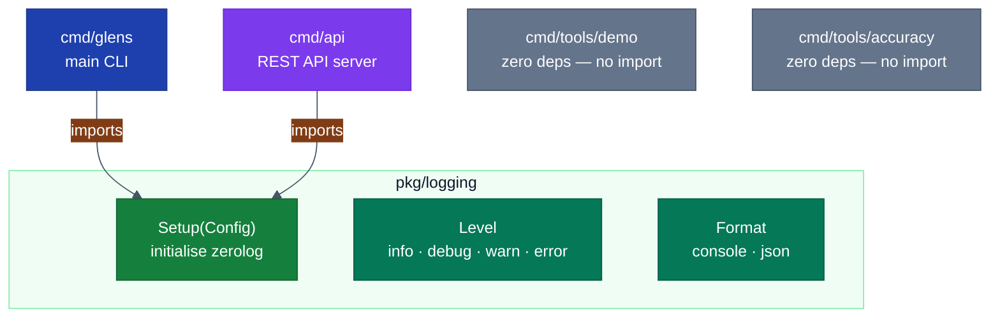
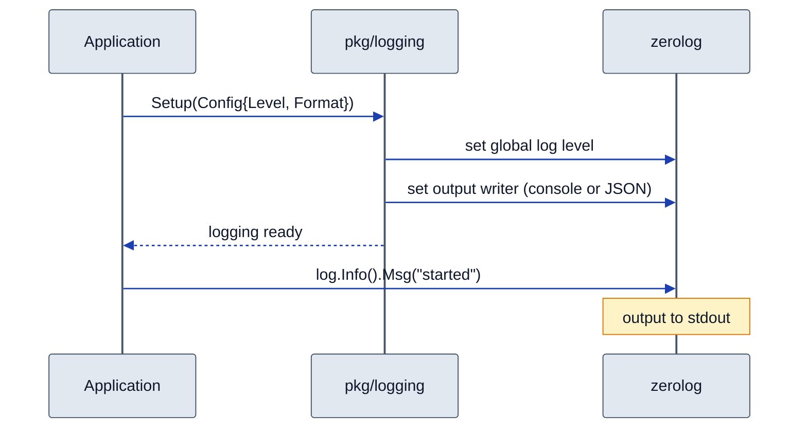

# pkg/logging — Architecture

> Detailed diagrams for the shared zerolog wrapper.
> Master diagrams: [docs/diagrams/architecture.md](../../../docs/diagrams/architecture.md)

## Logging Usage Across Modules

## Setup Sequence

